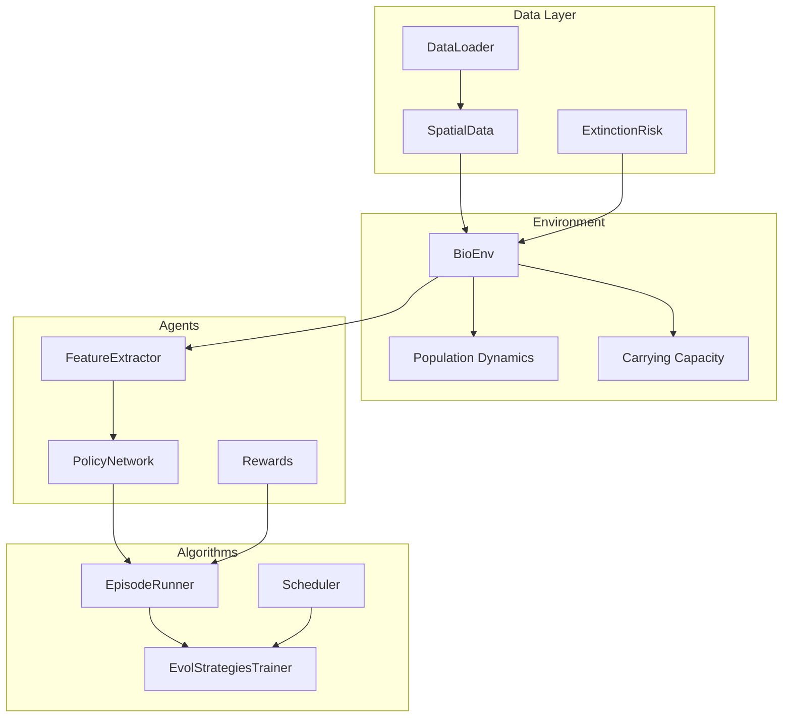
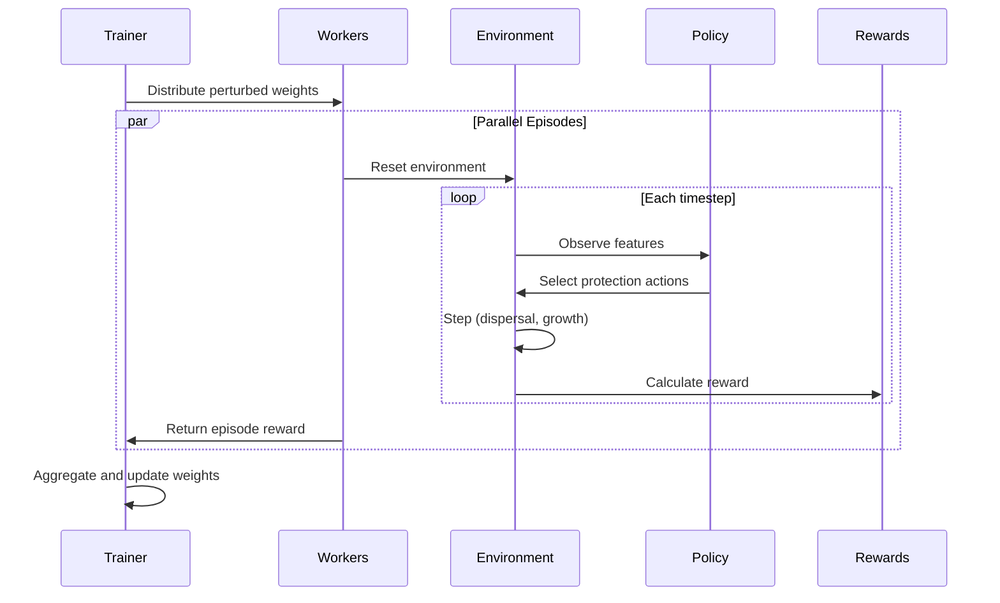

# Architecture Overview

This document describes the high-level architecture of CAPTAIN-NG.

## System Design



## Component Details

### BioEnv (Environment)

The central simulation environment managing:

- **Population matrix** `h`: Shape `(species, cells)`, current population per species per cell
- **Carrying capacity** `K`: Maximum sustainable population, modified by protection and disturbance
- **Dispersal**: Species movement between cells based on distance and dispersal rate
- **Growth**: Population growth capped by carrying capacity

#### Population Dynamics

Each timestep:

1. **Dispersal**: `h = h @ dispersal_matrix`
2. **Growth**: `h = h * growth_rates`
3. **Capacity limit**: `h = min(h, K)`

### SpatialData

Efficient container for gridded spatial data:

- Stores only valid (non-masked) cells in flattened form
- Supports temporal evolution via delta per step
- Memory-mapped backup for large datasets
- Reconstructs to 3D grid only for visualization

### FeatureExtractor

Transforms raw environment state into policy network inputs:

| Feature | Description | Shape |
|---------|-------------|-------|
| `time` | Normalized timestep | `(cells,)` |
| `disturbance` | Mean disturbance | `(cells,)` |
| `disturbance_conv` | Neighborhood disturbance | `(cells,)` |
| `species_richness` | Count of present species | `(cells,)` |
| `total_population` | Log-transformed total pop | `(cells,)` |
| `current_ext_risk` | One-hot per risk class | `(n_classes, cells)` |
| `cost` | Protection cost | `(cells,)` |
| `protection_matrix` | Current protection | `(cells,)` |

Features are z-score normalized with outlier clipping.

### PolicyNetwork

Neural network that scores cells for protection:

```
Input: (features, cells)
   ↓ Transpose
(cells, features)
   ↓ Linear(features → hidden)
   ↓ ReLU
   ↓ Linear(hidden → 1)
   ↓ Squeeze
Output: (cells,) scores
```

Top-k cells with highest scores are selected for protection.

### EpisodeRunner

Orchestrates a single episode:

```python
for timestep in range(n_steps):
    while protected_cells < target:
        features = feature_extractor.observe(env)
        actions = policy.get_actions(features, k, mask)
        env.update_protection_matrix(actions)
    env.step()
    reward += rewards.calc_total_reward(env)
```

### EvolStrategiesTrainer

Implements Natural Evolution Strategies (NES):

1. Generate noise perturbations: `ε ~ N(0, σ²I)`
2. Create population: `θ_i = θ + σε_i`
3. Evaluate fitness: `F_i = episode_reward(θ_i)`
4. Update weights: `θ ← θ + (α/nσ) Σ F_i ε_i`

Uses multiprocessing for parallel episode evaluation.

## Data Flow



## Memory Layout

For efficient GPU execution, tensors are organized as:

| Tensor | Shape | Layout | Notes |
|--------|-------|--------|-------|
| Population `h` | `(S, C)` | Dense | Species × Cells |
| Dispersal | `(C, C)` | Sparse CSR | Shared across species |
| Features | `(F, C)` | Dense | Features × Cells |
| Policy weights | `(1D)` | Dense | Flattened for ES |

Where S=species, C=cells, F=features.

## Extension Points

### Custom Rewards

```python
class MyReward(cn.CalcReward):
    def calc_reward(self, env: BioEnv) -> float:
        # Custom reward logic
        return reward_value
```

### Custom Features

```python
class MyFeatureExtractor(cn.FeatureExtractor):
    def extract_features(self, env: BioEnv) -> torch.Tensor:
        features = super().extract_features(env)
        # Add custom features
        return features
```

### Custom Policies

```python
class MyPolicy(nn.Module):
    def forward(self, x: torch.Tensor) -> torch.Tensor:
        # Custom architecture
        return scores
```
