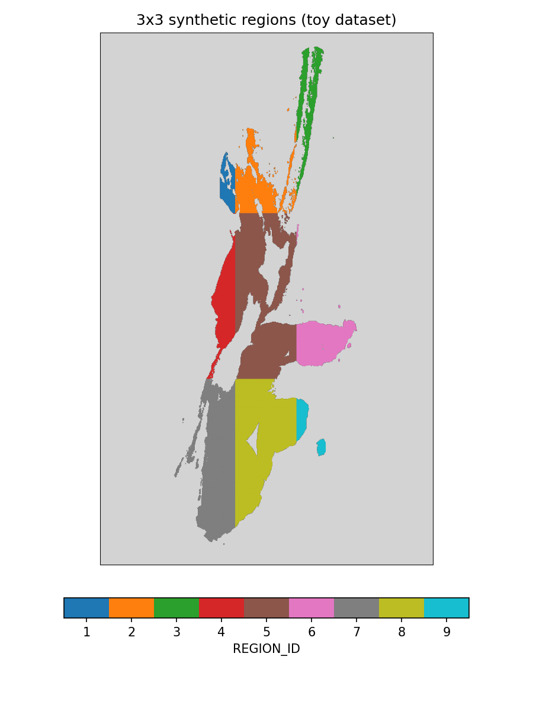
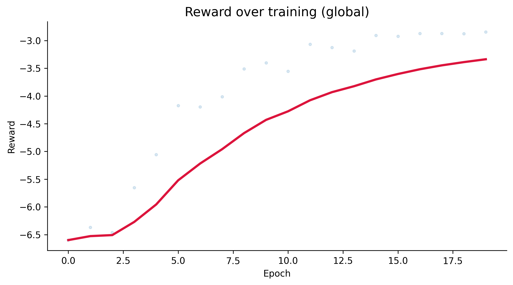
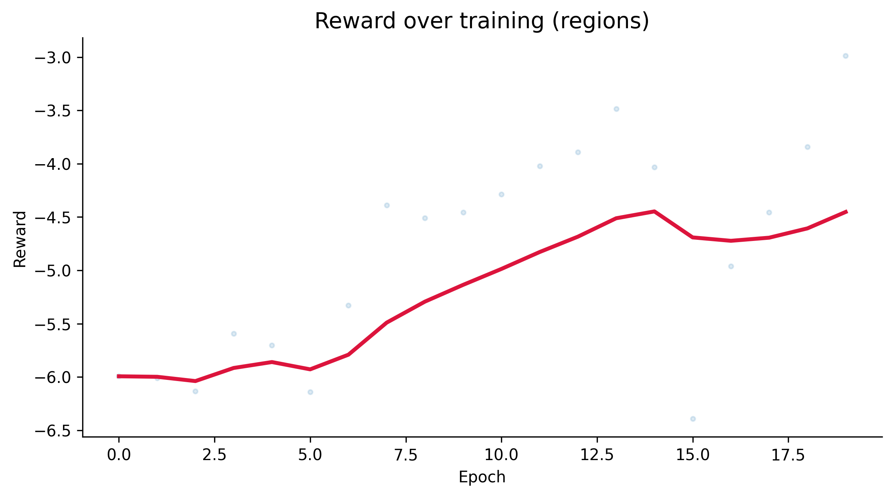
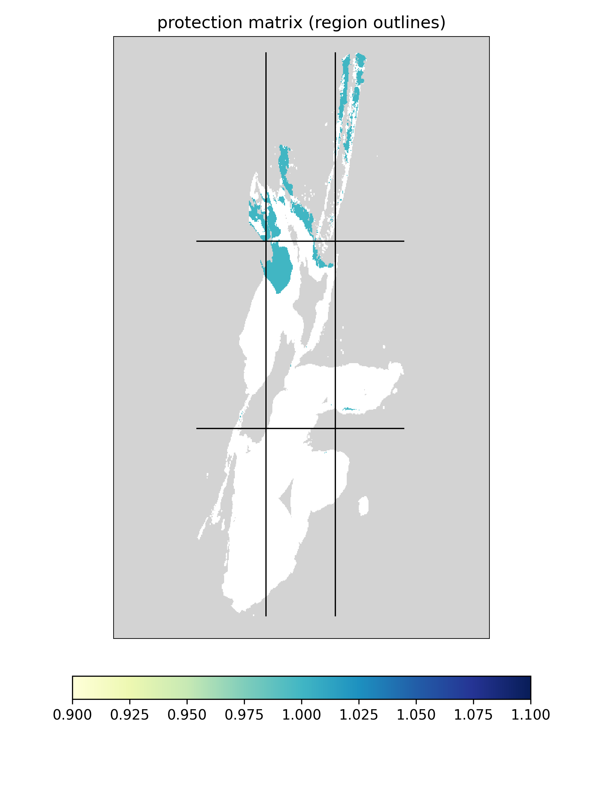
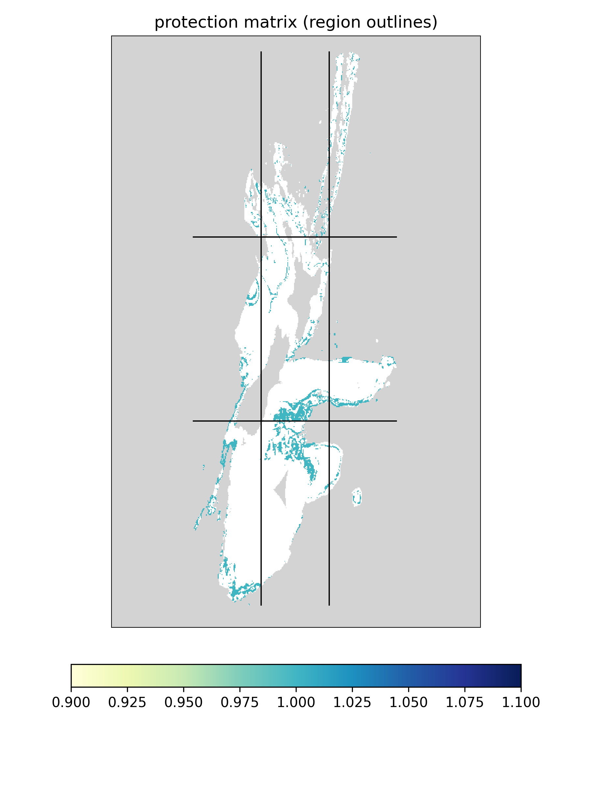
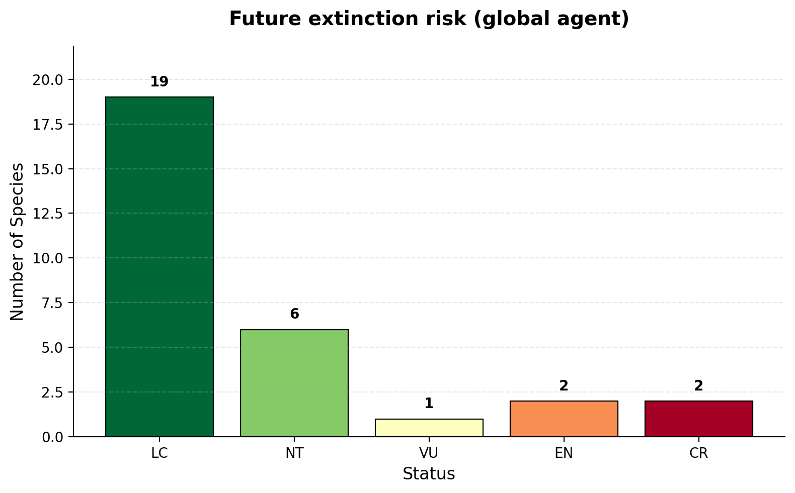
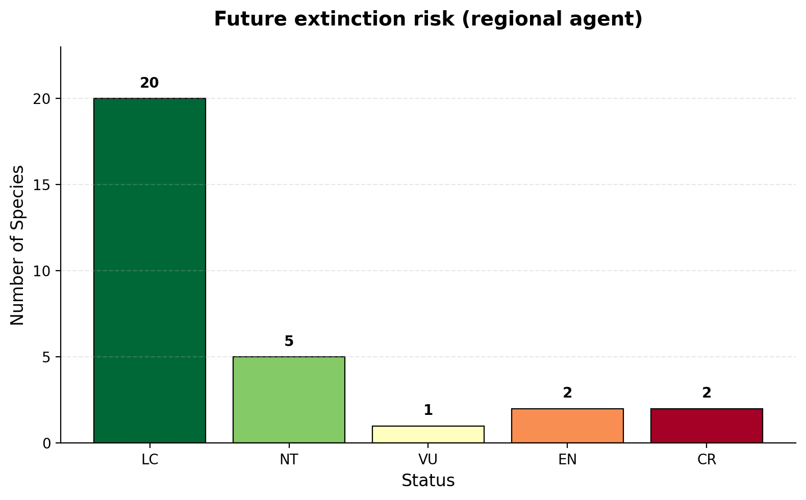
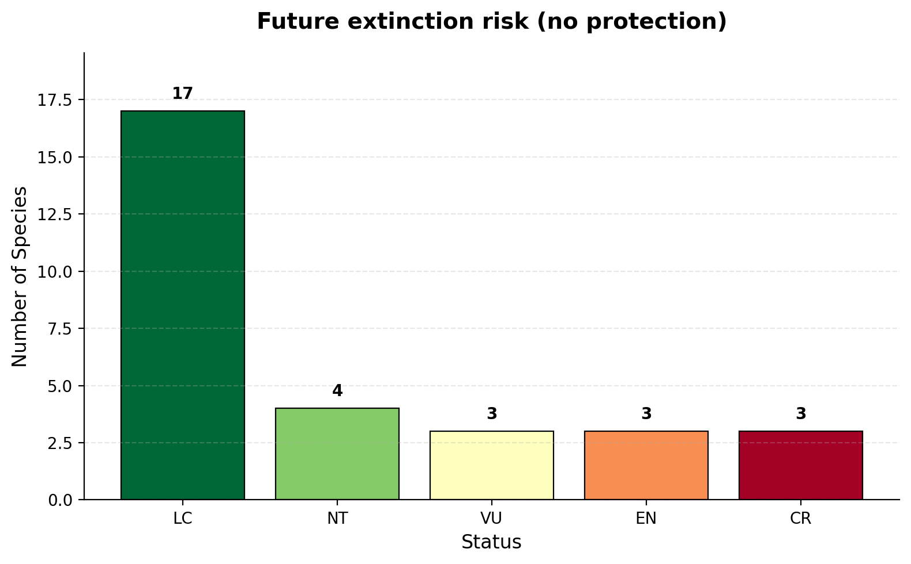

# Toy Example Walkthrough

This tutorial walks through training and evaluating a conservation policy with
CAPTAIN-NG using a small toy dataset (30 species over an 800x500 grid, ~58k
valid cells). It covers:

- what `train_policy.py` and `run_inference.py` do, end to end
- how to switch between a single **global** agent and **regional** multi-agent
  training
- how reward calibration works and why it runs before training
- what the output plots mean, with real examples from this dataset

## 0. Get the data

The dataset itself isn't part of this repo (it's ~60MB, distributed
separately). Download it from
[Polybox](https://polybox.ethz.ch/index.php/s/qYTHM7difqrBmo4) — it unzips
to a folder named `captain3example_data` (containing `present_sdms/`,
`future_sdms/`, `env_layers/`, `species_tbl.csv`, etc.; see that data
folder's own README for what each file is).

You don't need to place it inside this repo. Each script sets, near the top
of its Configuration section:

```python
DATA_DIR = Path(__file__).resolve().parent.parent / "data"
```

Just change that one line to wherever you put `captain3example_data`, e.g.:

```python
DATA_DIR = Path("/path/to/captain3example_data")
```

Keep it consistent across `calibrate_rewards.py`, `train_policy.py`, and
`run_inference.py` — they all need to agree on where the data (and each
other's outputs) live.

## 1. The scripts

Both scripts live in [`examples/`](../../examples/) and are configured via
module-level constants at the top of the file (no CLI flags) — open the file
and edit the constants directly before running.

| Script | Purpose |
|---|---|
| [`calibrate_rewards.py`](../../examples/calibrate_rewards.py) | One-time step: calibrates reward-term scales against the global agent and saves `reward_calibration.json`. |
| [`train_policy.py`](../../examples/train_policy.py) | Trains a policy with Evolution Strategies (ES), loading the saved reward calibration. |
| [`run_inference.py`](../../examples/run_inference.py) | Loads a trained policy and runs one episode, producing protection maps and extinction-risk plots, and optionally saves features, policy scores and cell rankings for xAI analyses. |

The downloaded `data/` already includes everything these scripts need,
including a region raster (`env_layers/regions.tif`) and lookup table
(`env_layers/regions_tbl.csv`) that partition the toy grid into 9 regions —
see [§2](#2-global-vs-regional-agents) for what these look like and how
they're used. (If you ever need to regenerate that region raster — e.g. with
a different number of regions — it's produced by
`scripts/create_toy_regions.py`, a one-off data-prep utility, not something
you need to run to follow this tutorial.)

Run them in this order with [`uv`](https://docs.astral.sh/uv/) from the repo root:

```bash
uv run python examples/calibrate_rewards.py    # once, to generate reward_calibration.json
uv run python examples/train_policy.py
uv run python examples/run_inference.py
```

The first only needs to be re-run if the dataset or reward terms/weights
change — not every time you train.

### What `calibrate_rewards.py` does

Since "extinction risk improvement" and "cost" naturally live on very
different numeric scales, `EvolStrategiesTrainer.get_reward_calibrated_weights()`
runs a handful of probe episodes and derives per-term multipliers so neither
term dominates the combined reward just because of its units. The result is
saved to `data/reward_calibration.json`.

Crucially, this script **always calibrates against the global agent**
(`USE_REGIONAL_AGENTS = False`, `REGION_ID = None`), regardless of what's set
in `train_policy.py` — it forces both internally. Calibration multipliers
depend on how many cells get protected during the probe episodes, so if
every agent mode calibrated itself independently, a global run and a
regional run would end up on different reward scales and their reward
curves wouldn't mean the same thing. Calibrating once, globally, and having
every mode load that same file keeps reward values comparable across
global/regional/single-region runs (see the example below).

### What `train_policy.py` does

1. Loads the mask, species distribution models (present/future), disturbance,
   cost, and species traits (including a per-species minimum habitat
   suitability, see [§3](#3-per-species-habitat-suitability-thresholds)) from
   `data/`.
2. Builds the simulation environment (`BioEnv`), a feature extractor, a small
   policy network (`CellNN` wrapped in `PolicyNetwork`), and a two-term reward
   (extinction-risk improvement + cost).
3. Loads the reward calibration produced by `calibrate_rewards.py` (raises a
   clear error if you haven't run it yet).
4. Trains for `N_EPOCHS` using Natural Evolution Strategies: at each epoch, it
   perturbs the policy's weights, runs an episode per perturbation, and moves
   the weights toward whichever perturbations scored higher reward.
5. Logs progress to a TSV file and saves the trained weights (`.npy`) and a
   protection-matrix snapshot every `PLOT_TRAIN_FREQ` epochs.

### What `run_inference.py` does

1. Rebuilds the same environment/agent setup as training (must use the same
   `USE_REGIONAL_AGENTS`/`REGION_ID` the model was trained with).
2. Loads the trained weights and runs one full episode with no learning
   (`NoRewards()`), recording which cells get protected over time.
3. Plots the final protection matrix, protection-through-time, and
   extinction-risk bar charts before/after protection.
4. Re-runs the same episode with an unlimited budget disabled
   (`NoBudgetManager()`) as a "no protection" baseline for comparison — this
   step is skipped in regional (`"All"`) mode, since it isn't compatible with
   the multi-agent policy.

#### Saving features and rankings for xAI

With `SAVE_XAI_DATA = True`, the episode runner gets an `InferenceRecorder`
that saves, at every policy decision, what the policy saw and how it ranked
the cells. The output goes to `inference/xai/` inside the model folder:

- `cells.npz`: each cell's grid coordinates, the grid shape, and the feature
  names.
- `step_{t:03d}_u00.npz`, one per decision: the policy score and rank of every
  cell, which cells were eligible, already protected, and selected, plus the
  features (both as fed to the network and raw).

Three settings control the output:

- `XAI_STEPS`: `"all"`, or a list of time steps, e.g. `[0]` for the initial
  ranking only.
- `XAI_SAMPLE_FRACTION`: `None` saves features for every cell. `0.05` saves
  features only for the top max(5%, selected) eligible cells plus an equally
  sized random sample of the remaining eligible cells. Scores and ranks are
  still saved for all cells. `sample_is_top` marks the two groups, and
  `sample_inclusion_prob` lets you reweight the random sample back to all
  eligible cells.
- `SEED`: makes the random sample reproducible.

With the toy data and `XAI_SAMPLE_FRACTION = 0.05`, each step file is about
1.3 MB (about 6.5 MB without subsampling). See
[`docs/inference.md`](../../docs/inference.md) for the full list of saved
arrays and how to load them.

With `PLOT_XAI = True`, the script also saves
`step_{t:03d}_u00_features_vs_scores.png` next to each step file: one scatter
plot per feature, with the feature value against the policy score and
selected cells highlighted. It's a quick first look at which features the
policy's ranking follows.

## 2. Global vs. regional agents

Both scripts share two config constants that control the agent setup:
a `USE_REGIONAL_AGENTS` switch, and a `REGION_ID` that only matters when
that switch is off:

```python
USE_REGIONAL_AGENTS = False; REGION_ID = None            # a single agent protects cells anywhere on the grid
USE_REGIONAL_AGENTS = True                                # one coordinated agent per region (9 regions in the toy data); REGION_ID is ignored
USE_REGIONAL_AGENTS = False; REGION_ID = "tile_r2_c2"     # a single agent restricted to one named region
```

| `USE_REGIONAL_AGENTS` | `REGION_ID` | Policy class | Budget manager | Behavior |
|---|---|---|---|---|
| `False` (default) | `None` | `PolicyNetwork` | `GlobalBudgetManager` | One agent, free to protect any valid cell. |
| `True` | *(ignored)* | `RegionalPolicyNetwork` | `RegionalBudgetManager` | One coordinated agent per region, each with its own protection budget proportional to the region's size. |
| `False` | a region name | `PolicyNetwork` | `GlobalBudgetManager` | One agent, restricted to a single region via `action_mask`. |

The 9 regions themselves (`data/env_layers/regions.tif`, looked up by name
via `regions_tbl.csv`) are a synthetic 3x3 tiling of the toy grid's valid
cells — not a real administrative boundary, just enough structure to
demonstrate multi-region training:



The two modes are trained identically otherwise (same reward, same shared
reward calibration from `calibrate_rewards.py`) — only how actions get
selected and budgeted differs. `train_policy.py` names its output folder
after the mode (`global_w1.0_w1.0_p0.0425/`, `regions_w1.0_w1.0_p0.0425/`, or
`<region_name>_w1.0_w1.0_p0.0425/`), and `run_inference.py` looks for the
model in the matching folder — so make sure `USE_REGIONAL_AGENTS`/`REGION_ID`
are set the same way in both scripts.

## 3. Per-species habitat suitability thresholds

`data/species_tbl.csv` has a `min_habitat_suitability` column (one value per
species, in this toy dataset randomly generated in [0.01, 0.1]). After
loading the species distribution models and traits, both scripts call:

```python
sdm.reset_threshold(traits["min_habitat_suitability"].to_numpy())
```

This sets a **per-species** minimum habitat-suitability value below which a
cell contributes nothing to that species' carrying capacity
(`BioEnv` uses `sdms.data_min_threshold` — a version of the SDM data with
sub-threshold cells zeroed out — when computing carrying capacity each step).
Before this change both scripts used one scalar threshold
(`MIN_HABITAT_SUITABILITY = 0.05`) for every species; now that constant is
set to `None` and is overridden by the per-species column. **This must be
applied identically in `train_policy.py` and `run_inference.py`** — if the
thresholds don't match between training and inference, you're evaluating the
policy in a different environment than it was trained in.

## 4. Example run

The plots below come from a real run of `train_policy.py`
(`N_EPOCHS=20, N_PERTURBATIONS=6, N_PARALLEL_WORKERS=4,
TARGET_PROTECTED_CELLS_FRACTION=0.10`) — running it yourself should reproduce
something close to this. Lower `N_EPOCHS` if you just want to smoke-test
that the pipeline runs end-to-end.

### Reward over training





Both runs load the same reward calibration (see `calibrate_rewards.py`
above), so these reward values are directly comparable. Both climb steadily
over the 20 epochs: the global agent from about -6.6 to -2.9, the regional
agent from about -6.0 to -3.0 — similar overall improvement, though the
regional agent's curve is noisier along the way (it's coordinating 9
sub-policies at once rather than one).

### Priority maps: global vs. regional agent





Both maps show which cells the trained policy chooses to protect (teal),
over the grey background of all valid cells, with the 9 region boundaries
from the map above overlaid as black outlines. The global agent is free to
place its entire protection budget wherever the combined reward is highest,
so it tends to concentrate along the highest-value stretches without regard
for region boundaries. The regional agent instead allocates a separate
budget to each tile, proportional to that tile's size (see the per-region
`size`/`target` values printed when `create_episode_runner()` runs), so
protection is spread more evenly across regions rather than concentrated in
a single best sub-area — useful when, e.g., different administrative regions
each need their own guaranteed share of protected land.

### Extinction risk: global vs. regional protection





Species are grouped into 5 IUCN-like risk categories (LC → CR), simulated
forward under each policy. With no protection at all, species end up at
17 LC / 4 NT / 3 VU / 3 EN / 3 CR. Both trained policies improve on that
substantially: the global agent reaches 19 LC / 6 NT / 1 VU / 2 EN / 2 CR,
and the regional agent does slightly better still, at 20 LC / 5 NT / 1 VU /
2 EN / 2 CR — spreading the same overall protection budget across all 9
regions (rather than letting the global agent concentrate it, see the
priority maps above) keeps one more species out of the Near Threatened
category here. This is a short, lightly-trained toy run, so treat the exact
numbers as illustrative rather than a general claim that regional agents
outperform global ones — longer training (more epochs/perturbations) is
where you'd want to draw real conclusions.

## 5. Next steps

- Try a specific region (`USE_REGIONAL_AGENTS = False; REGION_ID = "tile_r2_c2"`)
  to see a single agent restricted to one sub-area.
- Increase `N_EPOCHS`/`N_PERTURBATIONS` for a more thoroughly trained policy.
- Use the saved xAI data (`inference/xai/`) to see which features drive the
  policy's ranking, e.g. with a surrogate model of `features_input` against
  `scores`, or of top vs. random cells (`sample_is_top`).
